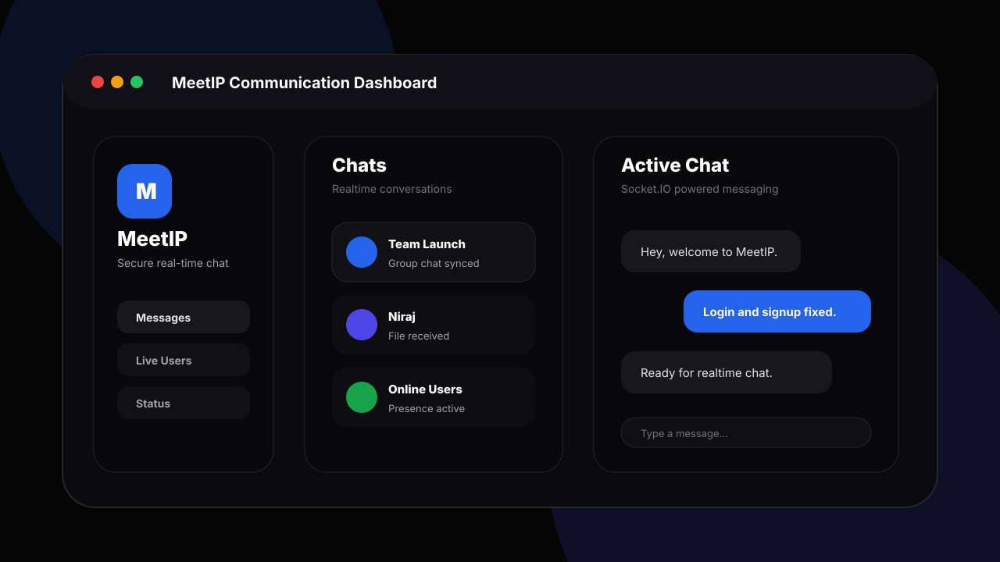

# MeetIP

MeetIP is a full-stack real-time communication platform built with React, Express, MongoDB, and Socket.IO. The project focuses on fast messaging, secure authentication, live presence, group conversations, profile management, and public/private status sharing inside a modern dark dashboard UI.



## Project Summary

MeetIP gives users a single place to create an account, log in securely, discover other users, start direct conversations, create group chats, share files, update profile information, and post status updates. The frontend is built with a polished React interface, while the backend handles authentication, protected APIs, database models, media uploads, and socket events for real-time communication.

## What We Built

- User registration and login with JWT authentication.
- Protected routes for dashboard, messages, profile, live users, status, settings, and blocked users.
- Real-time chat using Socket.IO.
- Direct chat creation and chat history loading.
- Group chat creation and group profile management.
- Message delivery states such as sent, delivered, and seen.
- File sharing support for images, PDFs, and other files.
- Live user presence tracking through authenticated sockets.
- Public and private status posting with media upload support.
- Profile update flow with avatar, bio, profession, connections, and blocked users.
- Responsive dark UI using React, Tailwind CSS classes, Framer Motion, and Lucide icons.

## Recent Work Completed

The authentication flow was reviewed and improved so login and signup work reliably across local development and deployment.

- Normalized the auth response shape to `{ user, token }`.
- Updated login and signup to store the real user object in global auth context.
- Centralized token storage in the auth service.
- Added safer error handling for auth requests.
- Cleared invalid saved tokens during session restore.
- Aligned local API requests through the Vite proxy.
- Aligned Socket.IO client configuration with the server URL.
- Added backend validation for missing registration and login fields.
- Normalized email and mobile number values before saving or searching users.

## Tech Stack

| Layer | Technology |
| --- | --- |
| Frontend | React 19, Vite, React Router |
| Styling and UI | Tailwind CSS classes, Framer Motion, Lucide React |
| API Client | Axios |
| Backend | Node.js, Express |
| Realtime | Socket.IO |
| Database | MongoDB with Mongoose |
| Authentication | JWT, bcryptjs |
| Uploads | Multer, local uploads folder, Cloudinary config |
| Deployment Ready | Vercel frontend config, Render-style backend URL fallback |

## Folder Structure

```text
MeetIP/
  client/
    src/
      api/              Axios API configuration
      components/       UI, layout, home, and chat components
      context/          Auth and chat context providers
      pages/            Route pages such as Login, Signup, Messages, Profile
      routes/           Public and protected route definitions
      services/         API service wrappers
      socket/           Socket.IO client setup
  server/
    config/             Database and Cloudinary configuration
    controllers/        Route logic for auth, chat, users, groups, status
    middleware/         Auth and upload middleware
    models/             Mongoose models
    routes/             Express route definitions
    uploads/            Uploaded media and files
  docs/
    project-preview.svg README visual preview
```

## Key Features

### Authentication

Users can create an account with username, email, mobile number, and password. Passwords are hashed before being stored. After login or signup, the API returns a JWT token and user data, allowing the frontend to restore the session and protect private routes.

### Realtime Messaging

Socket.IO powers live communication. When a user logs in, the client attaches the JWT to the socket handshake. The server validates the token, stores the connected user, and broadcasts online user presence.

### Direct and Group Chats

Users can create one-to-one conversations or group chats. Chat history is loaded from MongoDB, and the UI supports selecting chats, opening group windows, and receiving notifications when messages arrive.

### File Sharing

Messages can include text or uploaded files. The backend uses Multer for upload handling and stores file metadata with each message.

### Public and Private Status

MeetIP includes public status feeds and private status sharing. Users can post content, upload media, view statuses, like statuses, and control visibility for private updates.

### Profile and User Controls

Users can update profile information, manage avatars, view other profiles, block or unblock users, and keep profile updates synchronized in chat screens.

## API Overview

| Method | Endpoint | Purpose |
| --- | --- | --- |
| POST | `/api/auth/register` | Create a new account |
| POST | `/api/auth/login` | Log in and receive a JWT |
| GET | `/api/auth/profile` | Restore current authenticated user |
| GET | `/api/user/all` | Fetch registered users |
| GET | `/api/user/profile` | Fetch current profile |
| PUT | `/api/user/profile` | Update current profile |
| POST | `/api/chat` | Create or fetch a direct chat |
| GET | `/api/chat` | Fetch current user's chats |
| POST | `/api/chat/message` | Send text or file message |
| GET | `/api/chat/message/:chatId` | Fetch chat messages |
| POST | `/api/chat/group` | Create a group chat |
| GET | `/api/status/public` | Fetch public statuses |
| POST | `/api/status/public` | Create public status |
| GET | `/api/status/private` | Fetch visible private statuses |
| POST | `/api/status/private` | Create private status |

## Local Setup

### 1. Clone and install dependencies

```bash
git clone <your-repository-url>
cd MeetIP

cd server
npm install

cd ../client
npm install
```

### 2. Configure backend environment variables

Create `server/.env`:

```env
PORT=5006
MONGO_URI=your_mongodb_connection_string
JWT_SECRET=your_jwt_secret
CLOUDINARY_CLOUD_NAME=your_cloudinary_cloud_name
CLOUDINARY_API_KEY=your_cloudinary_api_key
CLOUDINARY_API_SECRET=your_cloudinary_api_secret
```

### 3. Optional frontend environment variables

For local development, the Vite proxy sends `/api` and `/socket.io` traffic to `http://localhost:5006`.

For deployment, set:

```env
VITE_API_URL=https://your-backend-url.com/api
VITE_SOCKET_URL=https://your-backend-url.com
```

### 4. Run the backend

```bash
cd server
npm run dev
```

The server runs on `http://localhost:5006` by default.

### 5. Run the frontend

```bash
cd client
npm run dev
```

Open the Vite URL shown in the terminal, usually `http://localhost:5173`.

## Build and Verification

```bash
cd client
npm run build
```

The production build verifies that the frontend compiles successfully.

```bash
cd server
node --check controllers/authController.js
node --check index.js
```

These commands verify the main backend files for JavaScript syntax issues.

## Screenshots

The README currently uses `docs/project-preview.svg` as a professional visual preview. To add a real application screenshot later:

1. Run the frontend and backend locally.
2. Open the dashboard or messages page.
3. Save the screenshot as `docs/meetip-screenshot.png`.
4. Replace the image path near the top of this README:

```md

```

## Security Notes

- Passwords are hashed with bcrypt before storage.
- Protected routes require JWT authentication.
- Socket connections are authenticated using the same JWT token.
- Invalid saved tokens are cleared during session restore.
- Sensitive values should stay inside `.env` files and should not be committed.

## Future Improvements

- Add automated tests for auth, chat, and status APIs.
- Add stronger upload validation and cloud storage integration.
- Add refresh tokens or token rotation for longer sessions.
- Add unread message counters and stronger notification controls.
- Add real production screenshots to replace the generated SVG preview.
- Improve lint health across the whole frontend codebase.

## Author

Created by Niraj as a full-stack real-time communication project.
